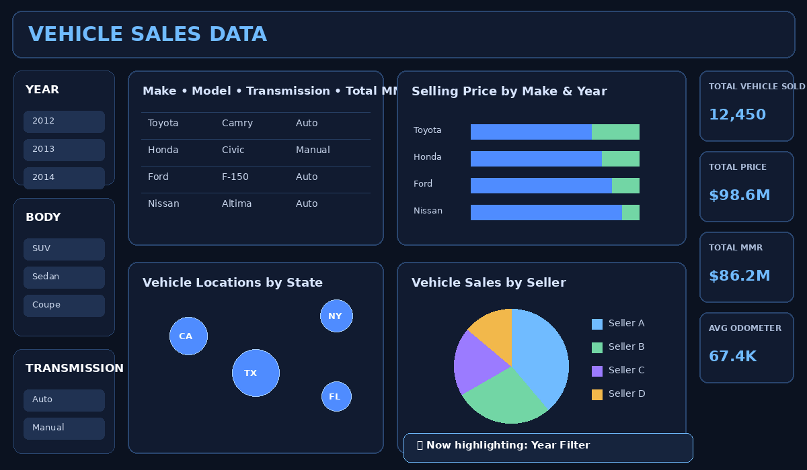
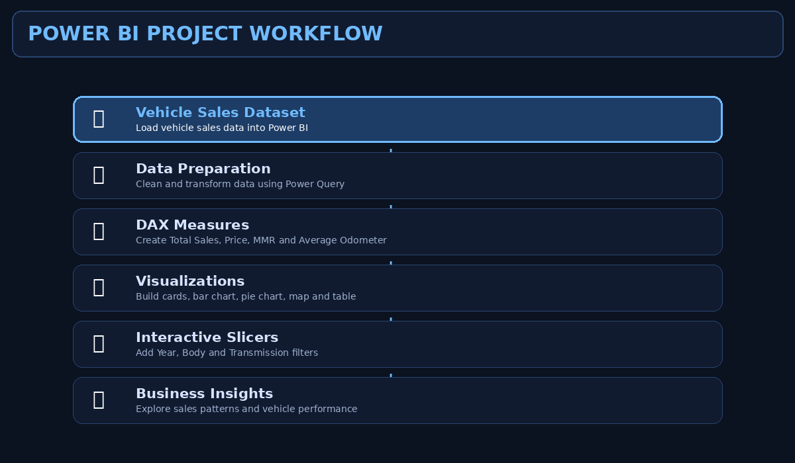
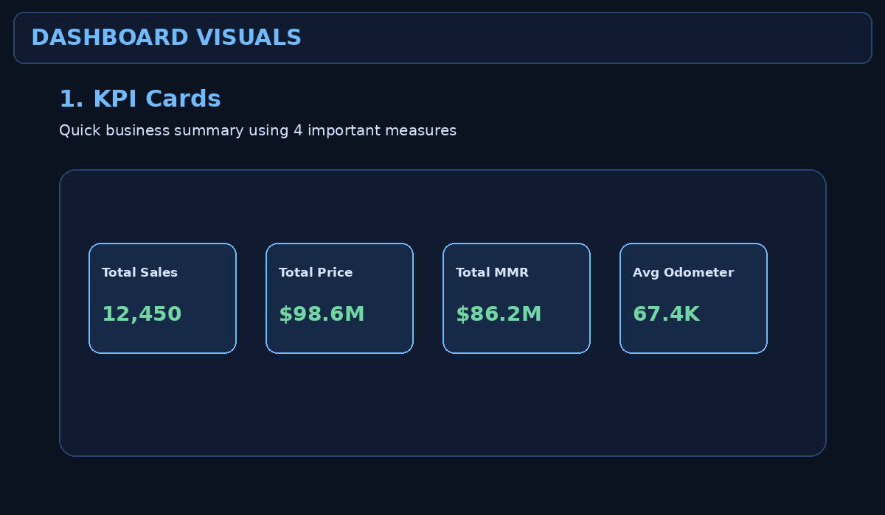
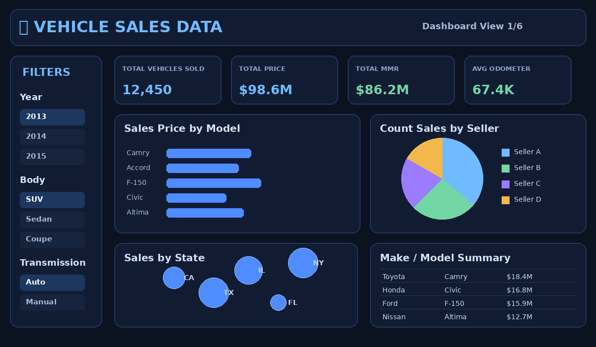

🚗 Vehicle Sales Data Analysis Dashboard

  

  <b>Interactive Power BI Dashboard for Vehicle Sales Analysis</b>

  
  
  
  

🌟 Project Overview

This project is an interactive Vehicle Sales Data Analysis Dashboard created in Power BI.

The dashboard is designed to analyze vehicle sales data through interactive slicers, KPI cards, charts, a map, and a detailed table. Users can filter the report and explore important sales patterns from multiple perspectives.

🎯 Main Objective

To transform raw vehicle sales data into an easy-to-understand interactive dashboard that supports analysis of:

🚗 Vehicle sales

💰 Selling price

📊 MMR value

🛣️ Odometer readings

🏷️ Vehicle make and model

👥 Seller performance

🗺️ State information

⚙️ Transmission type

🚘 Vehicle body type

📅 Year-based analysis

🎬 Dashboard Walkthrough

  

🔄 Project Workflow

  

The project follows this workflow:

Vehicle Sales Data
        ↓
Data Cleaning & Preparation
        ↓
Data Transformation
        ↓
DAX Measures
        ↓
Dashboard Visualizations
        ↓
Interactive Slicers
        ↓
Business Insights

📊 Dashboard Visuals

  

The actual PBIX report contains the following visual components:

Visual

Purpose

📝 Text Box

Dashboard heading: Vehicle Sales Data

🔢 KPI Card

Total vehicle sold

💰 KPI Card

Total price

📊 KPI Card

Total MMR

🛣️ KPI Card

Average odometer

📈 100% Stacked Bar Chart

Selling price by make with year comparison

🥧 Pie Chart

Sales distribution by seller

🗺️ Map

Vehicle state analysis

📋 Table

Make, total MMR, model and transmission

🎛️ Slicer

Year filter

🎛️ Slicer

Body filter

🎛️ Slicer

Transmission filter

📸 Dashboard Preview

  

🎯 KPI Cards

The dashboard includes four important business metrics.

🚗 Total Vehicle Sold

Shows the total number of vehicles sold.

💰 Total Price

Shows the overall selling price value.

📊 Total MMR

Shows the total Market Manheim Report value available in the report.

🛣️ Average Odometer

Shows the average odometer reading of vehicles.

📈 Sales Analysis by Make and Year

The dashboard uses a 100% Stacked Bar Chart for analyzing vehicle selling price.

Fields used

Category  → Make
Values    → Sum of Selling Price
Series    → Year

This visualization helps compare vehicle makes across different years.

🥧 Seller Analysis

A Pie Chart is used for seller-based sales analysis.

Fields used

Category → Seller
Values   → Total Sales

This helps understand how vehicle sales are distributed across sellers.

🗺️ State Analysis

A Map Visual is used with the state field.

Location → State

This provides a geographical view of the locations represented in the vehicle dataset.

📋 Vehicle Details Table

The report includes a table containing:

Make
Total MMR
Model
Transmission

This allows users to inspect detailed vehicle-related information.

🎛️ Interactive Slicers

The dashboard includes three slicers.

📅 Year

Filter the dashboard based on vehicle year.

🚘 Body

Filter vehicles according to body type.

⚙️ Transmission

Filter data based on transmission type.

All connected visuals can respond to the selected filters.

🧮 Measures Used in the Report

The PBIX report contains these measures:

total sales
total price
total mmr
avodmeter

These measures power the KPI cards and other report visuals.

🛠️ Tools & Technologies

Technology

Usage

🟡 Power BI

Dashboard creation

🧮 DAX

Measures and calculations

🧹 Power Query

Data preparation and transformation

📊 Data Visualization

Charts, cards, map and table

🎛️ Slicers

Interactive filtering

📂 Project Structure

Vehicle-Sales-PowerBI/
│
├── pra.pbix
├── README.md
│
└── assets/
    ├── dashboard_walkthrough.gif
    ├── project_workflow.gif
    ├── visuals_showcase.gif
    ├── dashboard_preview.png
    └── gradient-particle-wave-background.jpg

🚀 How to Run the Project

1️⃣ Download the Repository

Download or clone this project.

2️⃣ Open Power BI Desktop

Open the following file:

pra.pbix

3️⃣ Wait for the Report to Load

Allow Power BI to load the report and all visuals.

4️⃣ Use the Interactive Filters

Select values from:

Year

Body

Transmission

5️⃣ Explore the Dashboard

Analyze KPI cards, sales by make, seller distribution, state map, and vehicle details.

💡 Questions This Dashboard Can Help Answer

Which vehicle make has higher selling price?

How does selling price compare across years?

How are sales distributed across sellers?

Which states are represented in the report?

What is the total MMR value?

What is the average odometer reading?

How does transmission-based filtering affect the report?

How does vehicle body type affect the analysis?

🔮 Future Improvements

📅 Add monthly and quarterly trends

📈 Add Top N vehicle make and model analysis

💵 Add profit and cost analysis

🏆 Add seller ranking

🔍 Add drill-through pages

📉 Add advanced trend and forecasting visuals

🧭 Add more interactive navigation

👨‍💻 Author

Manan

  ⭐ If you like this project, give the repository a star!

  Made with ❤️ using Power BI

